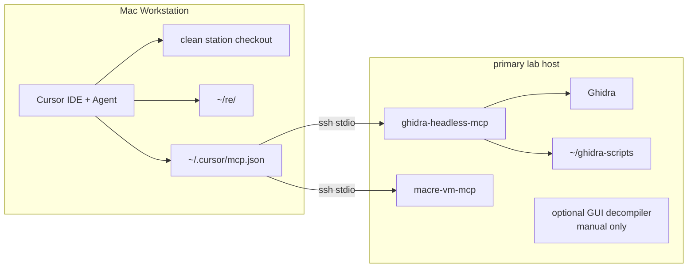

# Station Topology

> **Channel boundary:** `REPO_MODE=analysis`. This skill documents station
> routing and operating boundaries, not a vulnerability class.

## When To Use

- The operator is starting a new hunt project.
- An MCP call fails and you need to isolate SSH, Ghidra, script sync, or Cursor config.
- A task may require the crash-test, cross-platform, or Intel role.
- Another skill says "run this through Ghidra" and you need exact routing.

## The Picture



## Division Of Labor

| Question | Surface | Tool |
|----------|---------|------|
| Open/decompile/list functions | primary lab host | `ghidra-mcp` |
| Run hunt scripts | primary lab host | `ghidra-mcp` `ghidra.script` |
| Entitlements/codesign/launchd/logs | primary lab host | `macre-vm-mcp` |
| LLDB/DTrace | primary lab host or crash-test | `macre-vm-mcp` or direct SSH |
| Durable notes/findings | Workstation | private findings repo |
| Manual visual RE | lab-host GUI | optional GUI decompiler, not MCP |

## Workstation Paths

The station's dev repo lives at **`~/tools/skillz`** (canonical). Some
operator-facing notes still call it `~/tools/skills` — that is an alias,
not a separate tree. Any path referenced in this repo should resolve
under `~/tools/skillz/`. If the alias confuses muscle memory, run:

```bash
bash ~/tools/skillz/scripts/install-skills-symlink.sh
```

That creates `~/tools/skills` as a symlink to `~/tools/skillz` so both
names resolve. Idempotent; refuses to overwrite an existing non-symlink
directory at the alias path.

## Cold Start

```bash
cd ~/tools/skillz
./cursor/skill-link.sh
MACRE_MACHINE=<lab-host> bash scripts/install-vm-ssh-key.sh
MACRE_MACHINE=<lab-host> MACRE_REMOTE_HOME=/Users/<remote-user> bash scripts/deploy-macre-vm-mcp.sh
MACRE_MACHINE=<lab-host> MACRE_REMOTE_HOME=/Users/<remote-user> bash scripts/install-ghidra-host.sh --install
MACRE_MACHINE=<lab-host> MACRE_REMOTE_HOME=/Users/<remote-user> bash scripts/install-ghidra-host.sh --smoke
```

Then restart Cursor so `~/.cursor/mcp.json` reloads.

## Start A New Project

```bash
mkdir -p ~/re
git clone https://github.com/UnsaltedHash42/mac-reversing-station ~/re/<project-name>
cd ~/re/<project-name>
rsync -a --ignore-existing templates/findings-repo/ ./
bash scripts/smoke-findings-repo.sh
cp HANDOFF.md.template HANDOFF.md
cp machines.md.template machines.md
python3 scripts/start-target.py "/Applications/<App Name>.app" --pass-id PASS-001
MACRE_MACHINE=<lab-host> MACRE_REMOTE_TARGETS=/Users/<remote-user>/Targets bash scripts/rsync-to-vm.sh --record <target-id> targets/
```

Open `~/re/<project-name>` in Cursor and ask for one target path, pass ID, and artifact at a time. Use the `Lab Host Path Mapping` row in `CORPUS.md` when a Ghidra prompt needs the remote binary path.

## MCP Config

Active station entries:

- `ghidra-mcp`: `ssh <lab-host> /Users/<remote-user>/bin/ghidra-mcp-launch`
- `macre-vm-mcp`: `ssh <lab-host> /Users/<remote-user>/.venvs/macre-vm-mcp/bin/python -m macre_vm_mcp`

The old Hopper MCP server entry should be absent. Hopper remains a manual GUI escape hatch only.

## SSH Config (workstation)

Publish this stanza to `~/.ssh/config` for every lab host. The MCP transports already hold persistent SSH connections, but ad-hoc `ssh <lab-host> '<cmd>'` invocations from the Bash tool pay a fresh handshake per call without `ControlMaster`. PASS-001 measured cumulative minutes lost to repeat handshakes during polling.

```
Host <lab-host>
    ControlMaster auto
    ControlPath ~/.ssh/cm-%r@%h:%p
    ControlPersist 10m
    ServerAliveInterval 30
```

`ServerAliveInterval 30` keeps long-running scans from dropping when the SSH session goes idle (a 30-minute Ghidra analyzer phase emits no traffic). `ControlPersist 10m` reuses one TCP/SSH session for sub-10-ms repeats of `ssh <lab-host> '...'`.

`scripts/install-vm-ssh-key.sh` checks for this stanza and prints a recommendation if absent — it does not auto-edit `~/.ssh/config` to avoid clobbering operator-specific entries.

## Troubleshooting

- SSH fails: `ssh -o BatchMode=yes <lab-host> true`.
- Ghidra fails: `scripts/install-ghidra-host.sh --smoke`.
- Scripts missing remotely: `scripts/install-ghidra-host.sh --install`.
- Dynamic tools fail: `scripts/deploy-macre-vm-mcp.sh`.
- Cursor cannot see tools: validate `~/.cursor/mcp.json`, then restart Cursor.

## See Also

- `docs/topology.md`
- `README.md`
- `Skills/offensive-macos-tooling-ghidra-headless/SKILL.md`
- `Skills/offensive-macos-lab-roster/SKILL.md`
