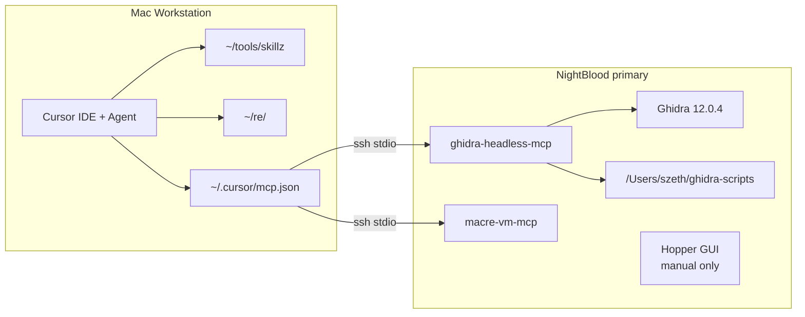

# Station Topology

> **Channel boundary:** `REPO_MODE=analysis`. This skill documents station
> routing and operating boundaries, not a vulnerability class.

## When To Use

- The operator is starting a new hunt project.
- An MCP call fails and you need to isolate SSH, Ghidra, script sync, or Cursor config.
- A task may require the crash-test, cross-platform, or Intel role.
- Another skill says "run this through Ghidra" and you need exact routing.

## The Picture



## Division Of Labor

| Question | Surface | Tool |
|----------|---------|------|
| Open/decompile/list functions | NightBlood | `ghidra-mcp` |
| Run hunt scripts | NightBlood | `ghidra-mcp` `ghidra.script` |
| Entitlements/codesign/launchd/logs | NightBlood | `macre-vm-mcp` |
| LLDB/DTrace | NightBlood or crash-test | `macre-vm-mcp` or direct SSH |
| Durable notes/findings | Workstation | private findings repo |
| Manual visual RE | NightBlood GUI | Hopper, not MCP |

## Cold Start

```bash
cd ~/tools/skillz
./cursor/skill-link.sh
bash scripts/install-vm-ssh-key.sh
bash scripts/deploy-macre-vm-mcp.sh
bash scripts/install-ghidra-host.sh --install
bash scripts/install-ghidra-host.sh --smoke
```

Then restart Cursor so `~/.cursor/mcp.json` reloads.

## Start A New Findings Repo

```bash
mkdir -p ~/re
cp -R ~/tools/skillz/templates/findings-repo ~/re/<program-name>
cd ~/re/<program-name>
git init
bash scripts/smoke-findings-repo.sh
cp HANDOFF.md.template HANDOFF.md
cp machines.md.template machines.md
```

Open `~/re/<program-name>` in Cursor and ask for one hunt class at a time.

## MCP Config

Active station entries:

- `ghidra-mcp`: `ssh NightBlood /Users/szeth/bin/ghidra-mcp-launch`
- `macre-vm-mcp`: `ssh NightBlood /Users/szeth/.venvs/macre-vm-mcp/bin/python -m macre_vm_mcp`

The old Hopper MCP server entry should be absent. Hopper remains a manual GUI escape hatch only.

## Troubleshooting

- SSH fails: `ssh -o BatchMode=yes NightBlood true`.
- Ghidra fails: `scripts/install-ghidra-host.sh --smoke`.
- Scripts missing remotely: `scripts/install-ghidra-host.sh --install`.
- Dynamic tools fail: `scripts/deploy-macre-vm-mcp.sh`.
- Cursor cannot see tools: validate `~/.cursor/mcp.json`, then restart Cursor.

## See Also

- `docs/topology.md`
- `docs/operator-guide.md`
- `Skills/offensive-macos-tooling-ghidra-headless/SKILL.md`
- `Skills/offensive-macos-lab-roster/SKILL.md`
