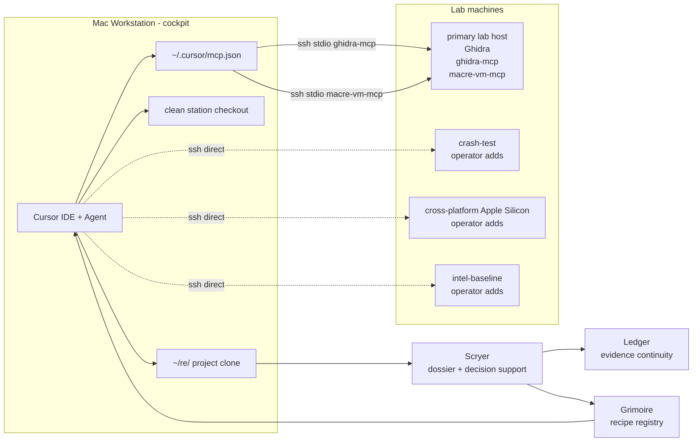

# Station Topology — Reference

This is the reference map for the macOS reversing station. The user-facing workflow lives in `README.md`.

## Diagram



## Host Roles

| Role | Alias | Purpose |
|------|---------------|---------|
| primary | `<lab-host>` | Static analysis, Ghidra headless, routine XPC/log/debug probes |
| crash-test | operator to fill | Panics, destructive daemon tests, fuzzing |
| cross-platform | operator to fill | Different Apple Silicon generation verification |
| intel-baseline | operator to fill | x86_64/macOS comparison |

The primary lab host is the only required remote host. The other roles improve evidence quality and reduce risk during destructive testing.

## MCP Servers

### `ghidra-mcp`

Cursor launches:

```json
"ghidra-mcp": {
  "command": "ssh",
  "args": [
    "-o", "BatchMode=yes",
    "-o", "ServerAliveInterval=30",
    "<lab-host>",
    "/Users/<remote-user>/bin/ghidra-mcp-launch"
  ],
  "env": {}
}
```

Primary lab-host components:

- Java: `/Users/<remote-user>/Applications/jdk-21.0.11+10/Contents/Home`
- Ghidra: `/Users/<remote-user>/Applications/ghidra_12.0.4_PUBLIC`
- MCP source: `/Users/<remote-user>/tools/ghidra-headless-mcp`
- MCP venv: `/Users/<remote-user>/.venvs/ghidra-headless-mcp`
- Hunt scripts: `/Users/<remote-user>/ghidra-scripts`
- Ghidra projects: `/Users/<remote-user>/ghidra-projects`

Verification:

```bash
scripts/install-ghidra-host.sh --smoke
```

### `macre-vm-mcp`

Cursor launches:

```json
"macre-vm-mcp": {
  "command": "ssh",
  "args": [
    "-o", "BatchMode=yes",
    "-o", "ServerAliveInterval=30",
    "<lab-host>",
    "/Users/<remote-user>/.venvs/macre-vm-mcp/bin/python",
    "-m", "macre_vm_mcp"
  ],
  "env": {}
}
```

Use it for LLDB, DTrace, codesign, entitlements, launchd, and logs. Bridge workflows use `macre-vm-mcp` to carry Ghidra-derived anchors into LLDB batch confirmation after lab safety allows the test shape.

## Hopper Status

Hopper is retired from the agent MCP loop. The old Hopper bridge entry should be absent from `~/.cursor/mcp.json`.

Hopper or another GUI decompiler may remain installed on the lab host for manual depth work. Do not make agent workflows depend on GUI menus, plugin injection, or document-loaded state.

## Files That Define The Station

| Path | Purpose |
|------|---------|
| `scripts/install-ghidra-host.sh` | Install/check/smoke Ghidra + headless MCP on the primary lab host |
| `ghidra-scripts/` | Read-only hunt scripts synced to the lab host |
| `macre-vm-mcp/` | VM-side dynamic tooling MCP server |
| `templates/findings-repo/` | Private research repo starter with lab safety, corpus, Ledger, metrics, reporting, and handoff templates |
| `docs/ontology/` | Shared macOS vulnerability-class ontology |
| `docs/playbooks/` | Third-party app family playbooks and Grimoire recipe registry |
| `Skills/offensive-macos-*` | Cursor skills for tooling, hunts, ontology, playbooks, discipline, lab, and reporting |
| `README.md` | How to set up and operate the station |

## Health Checks

```bash
ssh -o BatchMode=yes <lab-host> true
python3 -m json.tool ~/.cursor/mcp.json >/dev/null
scripts/install-ghidra-host.sh --smoke
tests/ghidra-scripts/smoke.sh
python3 scripts/validate_workstation_bundles.py
```

`scripts/smoke-wave3.sh` runs structural station checks. Its live mode may call the lab-host and Ghidra smoke paths above.

## Failure Boundaries

- SSH failure: fix `~/.ssh/config` or key auth first.
- `ghidra-mcp` failure: run `scripts/install-ghidra-host.sh --smoke`.
- Script missing: rerun `scripts/install-ghidra-host.sh --install` to sync `ghidra-scripts/`.
- Dynamic tool failure: run `scripts/deploy-macre-vm-mcp.sh`.
- Cursor tool list stale: restart Cursor after editing `~/.cursor/mcp.json`.
